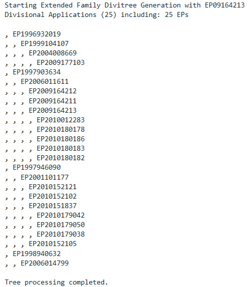
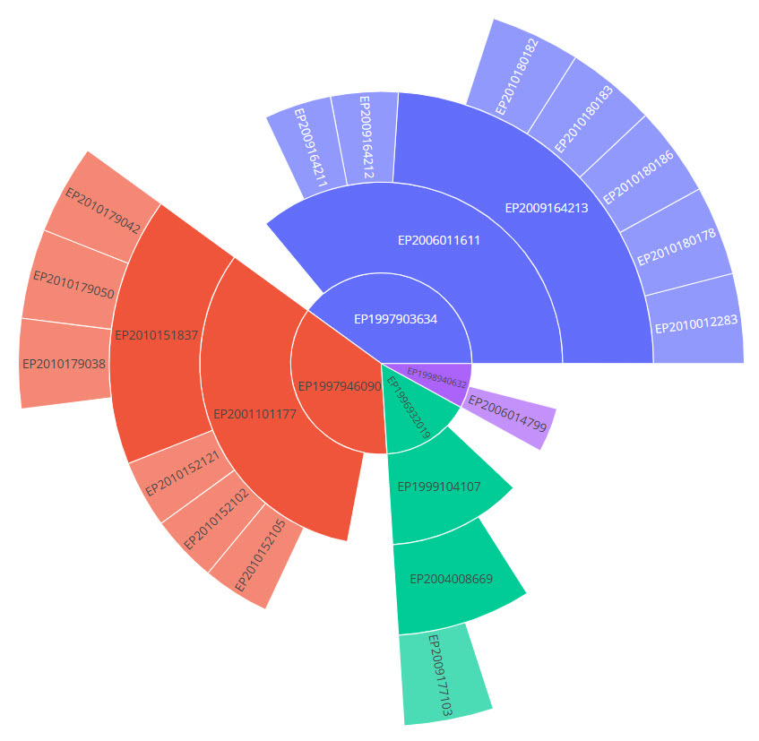

# From familyTree to DiviTree
This section introduces the purpose of the notebook: to demonstrate the use of **TIP**, the Technology Intelligence Platform, through a real life example using data from **OPS**, the EPO's Open Patent Services.

By leveraging the family method in OPS, which provides access to the INPADOC family, and visualizing the results with Plotly's sunburst chart, familyTree offers a vibrant, spherical, and interactive view of patent families. It shows relationships by branches and parent-child links in a format that can be intuitively explored through zooming and clicking. 

When applied to divisional applications, this approach is referred to as DiviTree, which first creates a text tree as in the example given here:

It can then display EP/WO family members available at EPO, along with corresponding national applications converted from EP applications.

Below is the EP family tree of patent application EP09164213, available at EPO, where each of the four branches corresponds to a distinct simple family:

